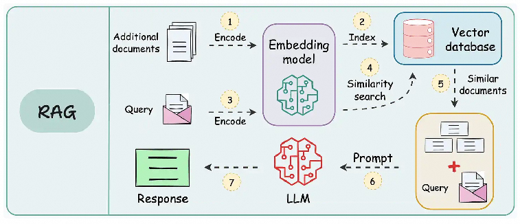
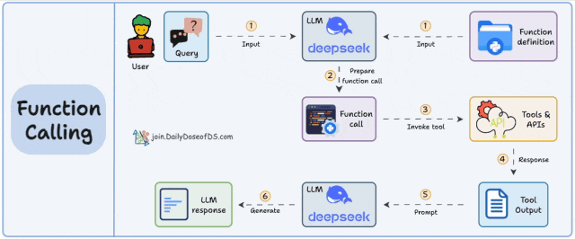
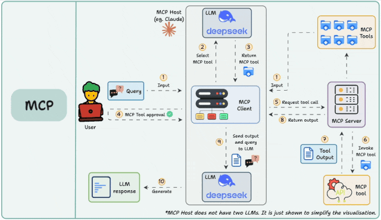

## Model Context Protocol (MCP)
- Model Context Protocol (MCP) 是一个开放协议，它使 LLM 应用与外部数据源和工具之间的无缝集成成为可能。无论你是构建 AI 驱动的 IDE、改善 chat 交互，还是构建自定义的 AI 工作流，MCP 提供了一种标准化的方式，将 LLM 与它们所需的上下文连接起来。
- MCP is an open protocol that enables AI models to securely interact with local and remote resources through standardized server implementations.
- https://github.com/punkpeye/awesome-mcp-servers

#### MCP、RAG、Function Calling之间的联系
> RAG 是为了让大模型获取足够的上下文，Function Calling 是为了让模型使用工具，他们和 MCP 有或多或少的联系

- RAG（Retrieval Augmented Generation ，检索增强生成），我们不需要训练和微调大模型，只需要提供和用户提问相关的额外的信息到提示词中，从而可以获得更高质量的回答。

 	

	- 通常，需要将资料通过嵌入模型生成服务转化为向量，然后存储到向量数据库中。
	- 当用户提问时，将用户的问题向量化从向量数据库中进行相似度匹配出 TOP N 个片段，拼接成新的提示词发送给大模型，大模型就可以结合你的资料更好地回答问题了。
	- 当然， RAG 还有很多变种，如 Agentic RAG 、Modular RAG、Graph RAG 等多种高级形式。
- Function Calling (函数调用) 是一种允许大型语言模型(LLM)根据用户输入识别它需要的工具并决定何时调用该工具的机制。

	

	- 基本工作原理如下：LLM 接收用户的提示词，LLM 决定它需要的工具，执行方法调用，后端服务执行实际的请求给出处理结果，大语言模型根据处理结果生成最终给用户的回答。
	- 不同的 API 需要封装成不同的方法，通常需要编写代码，很难在不同的平台灵活复用。
- 模型上下文协议（Model Context Protocol，简称MCP）是一个由 Anthropic 在 2024 年 11 月 25 日开源的新标准。MCP 是一个开放标准，旨在连接AI助手与数据所在的系统，包括内容存储库、业务工具和开发环境。其目标是帮助前沿模型产生更好、更相关的响应。
	- MCP 可以看作是 AI 应用程序的 "USB-C端口"。就像 USB-C 为连接设备与各种外设提供了标准化方式，MCP为 AI 模型连接不同数据源和工具提供了标准化方法。

	

	- MCP 的核心
		- 从技术角度看，MCP 遵循客户端-服务器架构，其中主机应用可以连接到多个服务器。
		- MCP 有三个关键组件：
			- 主机(Host)
			- 客户端(Client)
			- 服务器(Server)
	- 组件详解
		- 主机：代表任何提供 AI 交互环境的应用程序(如 Claude 桌面版、Cursor)，它能访问工具和数据，并运行 MCP 客户端。
		- MCP 客户端：在主机内运行，使其能与 MCP 服务器通信。
		- MCP 服务器：暴露特定功能并提供数据访问，例如：
			- 工具：使 LLM 能通过服务器执行操作
			- 资源：向 LLM 公开服务器中的数据和内容
			- 提示：创建可重用的提示模板和工作流
	- MCP过程

		
	
		- 首先需要在主机上自动或手动配置 MCP 服务，当用户输入问题时， MCP 客户端让 大语言模型选择 MCP 工具，大模型选择好 MCP 工具以后， MCP 客户端寻求用户同意（很多产品支持配置自动同意），MCP 客户端请求 MCP 服务器， MCP 服务调用工具并将工具的结果返回给 MCP 客户端， MCP 客户端将模型调用结果和用户的查询发送给大语言模型，大语言模型组织答案给用户。
		- 其实 RAG 、Function Call 和 MCP 本质上都是一样，都是为了借助外部工具帮助大模型完成更复杂的事情。