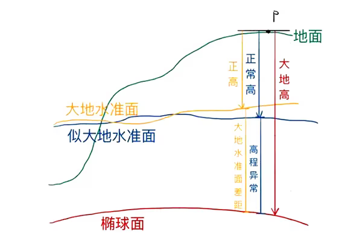

## 2000大地高、85高和大地高、正常高、正高
- 
#### 2000大地高
- 高程起算自CGCS2000参考椭球表面。使用RTK接CORS账号测量，端口配置为8003，RTK测量的高程即2000大地高

#### 85高
- 1985国家高程基准是我国现行的法定高程基准。
- 采用青岛验潮站1952～1979年的验潮资料，建立了1985国家高程基准。在观象山上建立永久水准原点，水准原点高出黄海平均海水面72.2604米。
- 依据“1985国家高程基准”推算国家水准网中各水准点的高程，作为全国的统一的高程控制系统。
- 为了区分1956黄海高程基准，称为1985国家高程基准，简称85高。
- 1985国家高程基准与1956黄海高程基准换算：

		1985国家高程=1956年黄海高程－0.029（米）

- 所有工程建设控制点高程几乎都是85高。

#### 2000大地高与85高区别
- 2000大地高是椭球高，85高是正常高。

#### 大地高、正常高、正高
- **正高**是相对于大地水准面的
- **正常高**是相对于似大地水准面。
	- 由此观之，实际生产中只有正高是有物理意义的，而正常高和大地高只是数学概念（不是客观存在，是人为定义的）。
	- 为了方便，大地测量学家创建了似大地水准面模型以代替大地水准面，因而实际生产中普遍用正常高。
- 大地水准面它是重力等位面，即物体沿该面运动时，重力不做功
（如水在这个面上是不会流动的）。
- 大地水准面是描述地球形状的一个重要物理参考面，也是海拔高程系统的起算面。