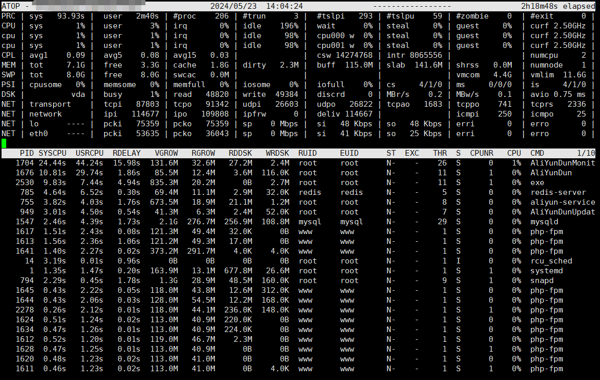

## atop监控工具
- 安装atop。

		sudo apt install atop
- （可选）如需监测网络使用率，可安装网络监控模块netatop。
	- 执行如下命令，安装netatop所需的模块。

			sudo apt install zlib1g-dev
	- 执行如下命令，下载netatop安装包。

			sudo wget https://www.atoptool.nl/download/netatop-3.1.tar.gz --no-check-certificate
	- 执行如下命令，解压netatop安装包。

			tar -zxvf netatop-3.1.tar.gz
	- 切换到netatop-3.1目录。

 			cd netatop-3.1
	- 执行如下命令，编译并安装netatop。

 			sudo make && sudo make install
	- 执行如下命令，启动netatop。

 			sudo systemctl start netatop
- 配置并启动atop
	- 配置文件位置: `/etc/default/atop`
	- 修改以下配置。
		- `LOGOPTS`：用于控制日志文件记录选项的一个重要参数，允许您自定义日志文件的保存路径、命名规则、滚动周期以及其他与日志记录相关的选项。为空""表示不使用任何额外选项。
			- 如果您想每天生成一个atop日志，请设置
			
					LOGOPTS="-w /var/log/atop/atop_$(date +\%Y\%m\%d) -b 86400"。
		- `LOGINTERVAL`：监控周期，建议将默认的监控周期600s修改为30s。
		- `LOGGENERATIONS`：日志保留时间，为避免atop长时间运行占用太多磁盘空间，建议将默认的日志保留时间28天修改为7天。
		- `LOGPATH`：指定atop日志文件的路径。默认值为`/var/log/atop`。

 
				LOGOPTS=""
				LOGINTERVAL=30
				LOGGENERATIONS=7
				LOGPATH=/var/log/atop
	- 重启atop服务。

 			sudo systemctl restart atop
- 分析atop日志
	- 查看日志文件。

			atop -r /var/log/atop/atop_20240523
	- atop常用命令
		- 打开日志文件后，您可以使用以下命令筛选数据。

				g：切换回默认的综合输出视图。
				
				c：显示进程列完整命令行。
				
				m：按照进程内存使用率进行降序筛选。
				
				d：按照进程磁盘使用率进行降序筛选。
				
				a：按照进程资源综合使用率进行降序筛选。
				
				n：按照进程网络使用率进行降序筛选。
				
				t：跳转到下一个监控采集点。
				
				T：跳转到上一个监控采集点。
				
				b：指定时间点，格式为YYYYMMDDhhmm。
	- 系统资源监控字段含义  
	
		
		- 主要参数说明如下
			- ATOP行: 主机名、信息采样日期和时间点。
			- PRC行: 进程整体运行情况。

					sys、user：分别代表进程在内核态和用户态的运行时间。
					#proc：进程总数。
					#trun：处于running状态进程数。
					#tslpi：处于sleeping interruptible状态的进程数。
					#tslpu：处于sleeping uninterruptible状态的进程数。
					#zombie：僵死进程的数量。
					#exit：atop采样周期内退出的进程数。

			- CPU行: CPU整体的使用情况，即多核CPU作为一个整体CPU资源的使用情况。CPU行各个字段数字相加结果为N*100%，其中N为CPU的核数。

					sys、user：CPU在用于处理进程时，进程在内核态及用户态所占CPU的时间比例。
					irq：CPU用于处理中断的时间比例。
					idle：CPU处在完全空闲状态的时间比例。
					wait：CPU处在进程等待磁盘IO导致CPU空闲状态的时间比例。

			- CPL行: CPU负载情况。

					avg1、avg5和avg15：分别代表过去1分钟、5分钟和15分钟内运行队列中的平均进程数量。
					csw：上下文切换次数。
					intr：中断发生次数。

			- MEM行: 内存的使用情况。

					tot：物理内存总量。
					free：空闲内存的大小。
					cache：用于页缓存的内存大小。
					buff：用于文件缓存的内存大小。
					slab：系统内核占用的内存大小。

			- SWP行: 交换空间的使用情况。

					tot：交换区总量。
					free：空闲交换空间大小。

			- PAG行: 虚拟内存分页情况。

					swin、swout：分别代表换入和换出内存页数。

			- DSK行: 磁盘使用情况，每一个磁盘设备对应一列，如果有vdb设备，那么将会增加一行DSK信息。

					vda：磁盘设备标识。
					busy：磁盘处于busy状态的时间比例。
					read、write：分别代表读、写请求数量。

			- NET行: 多列NET展示了网络状况，包括传输层TCP和UDP、IP层以及各活动的网口信息。

					****i：各层或活动网口接收包大小。
					****o：各层或活动网口发送包大小。