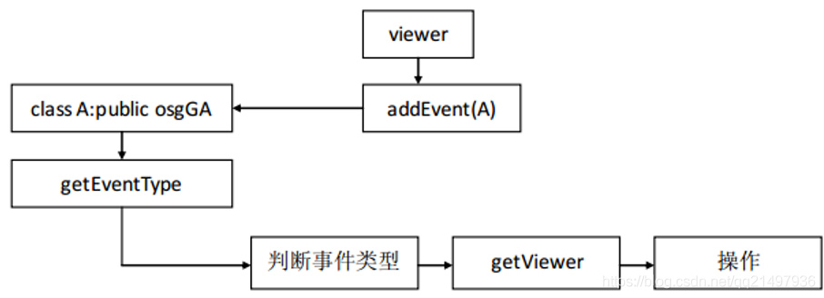

## OSG交互
#### 前言
- 交互一般指鼠标和键盘、也可以是触摸等，在地球的基础上增加方向键控制旋转、鼠标控制显示、缩放和重置模型状态。

#### 交互概述
- 操作三维场景主要是操作三维场景数据，场景数据主要由viewer负责进行渲染，要得到数据可以使用`viewer->getSceneData()`就可以了。
- Viewer主要功能是控制场景，是场景的核心类。
- Viewer中有`addEventHandler`就是专门添加事件处理器相应交互动作的（鼠标和键盘），可以自己写事件处理器，对事件进行处理。

- 事件类型有很多，一个viewer可以相应ABCD等等多个事件，一个事件也可以拦截事件，也就是A处理完后给BCD处理，也可以拦截住使BCD收不到事件。
- 存在事件，必然存在事件参数，给事件A传递参数，不必非要使用viewer进行处理，可以把viewer当参数传递进去。

#### 交互实现方式与步骤
- 本次介绍的方式是非回调方式，继承GUI事件类并重写虚函数即可。
- 交互的实现方式是继承GUI事件类，然后重写其虚函数，步骤如下：
	- 步骤一：继承`osgGA::GUIEventHandler`
	- 步骤二：重写虚函数`handler`，在里面重写事件

#### 交互动作
- 在之前的地球上添加事件：
	- 方向键左：地球向左旋转
	- 方向键右：地球向右旋转
	- 方向键上：地球向上旋转
	- 方向键下：地球向下旋转
	- 鼠标滚轮向上：地球放大
	- 鼠标滚轮向下：地球缩小
	- 鼠标点击右键：地球显示
	- 鼠标点击左键：地球隐藏
	- 鼠标点击中间：地球显示、地球恢复原始角度、地球恢复原始大小

#### 模型多种类型动作的理解
- 渲染效果有渲染效果的类节点，变换有变换的类节点，开关节点有开关节点的类节点，
- 一个结点要实现多种的类型的，那就需要创建对应类型的结点，一层一层包裹起来，如下面的地球代码，既要实现变换又要实现显示隐藏所以需要创建3种类型的结点，第一种是模型（几何体）、第二种是变换（移动、缩放、旋转）、第三种是开关（显示、隐藏）。

#### 相关代码
- 地球代码

		osg::ref_ptr<osg::Node> OsgWidget::getEarthSphiereAndKeyEvent()
		{
		    // 该结点是为了开关
		    osg::ref_ptr<osg::Switch> pSwitch = new osg::Switch;
		    // 该结点是为了变换
		    osg::ref_ptr<osg::MatrixTransform> pTrans = new osg::MatrixTransform;
		#if 1
		    {
		        // 绘制球体
		        // 步骤一：绘制几何类型(几何体)
		        osg::ref_ptr<osg::Geode> pGeode = new osg::Geode;
		        qreal radius = 1.0;
		        pGeode->addDrawable(new osg::ShapeDrawable(new osg::Sphere(osg::Vec3(0, 0, 0), radius)));
		        // 步骤二：加载图片添加纹理
		        osg::ref_ptr<osg::Image> pImage;
		        pImage = osgDB::readImageFile("D:/qtProject/osgDemo/osgDemo/modules/osgWidget/image/earth.bmp");
		        osg::ref_ptr<osg::Texture2D> pTexture2D = new osg::Texture2D;
		        pTexture2D->setImage(pImage.get());
		        // 步骤三：渲染设置
		        osg::ref_ptr<osg::StateSet> pStateSet = pGeode->getOrCreateStateSet();
		        pStateSet->setTextureAttribute(0, pTexture2D.get());
		        pStateSet->setTextureMode(0, GL_TEXTURE_2D, osg::StateAttribute::ON);
		        pGeode->setStateSet(pStateSet);
		        pTrans->addChild(pGeode);
		        // 步骤四：添加事件管理器
		        _pViewer->addEventHandler(new MyUserEventHandler);
		    }
		#endif
		    pSwitch->addChild(pTrans);
		    return pSwitch.get();
		}
- 事件代码
	- MyUserEventHandler.h

			#ifndef MYUSEREVENTHANDLER_H
			#define MYUSEREVENTHANDLER_H
			 
			#include <osg/Node>
			#include <osgViewer/Viewer>
			 
			class MyUserEventHandler : public osgGA::GUIEventHandler
			{
			 
			public:
			    MyUserEventHandler();
			 
			public:
			    /** Handle event. Override the handle(..) method in your event handlers to respond to events. */
			    // virtual bool handle(osgGA::Event* event, osg::Object* pObject, osg::NodeVisitor* pNodeVisitor);
			 
			    /** Handle events, return true if handled, false otherwise. */
			   // virtual bool handle(const osgGA::GUIEventAdapter& guiEventAdapter, osgGA::GUIActionAdapter& guiActionAdapter, osg::Object* pObject, osg::NodeVisitor* pNodeVisitor);
			 
			    /** Deprecated, Handle events, return true if handled, false otherwise. */
			virtual bool handle(const osgGA::GUIEventAdapter& guiEventAdapter,
			 osgGA::GUIActionAdapter& guiActionAdapter);
			 
			private:
			    float _scale = 1.0f;  // 保存当前相对于原始比例的缩放系数
			};
			 
			#endif // MYUSEREVENTHANDLER_H
	- MyUserEventHandler.cpp

			bool MyUserEventHandler::handle(const osgGA::GUIEventAdapter &guiEventAdapter, osgGA::GUIActionAdapter &guiActionAdapter)
			{
			    bool flag = false;
			    // 获取viwerer
			    osg::ref_ptr<osgViewer::Viewer> pViewer = dynamic_cast<osgViewer::Viewer*>(&guiActionAdapter);
			    if(!pViewer)
			    {
			        return false;
			    }
			    osg::ref_ptr<osg::Switch> pSwitch = pViewer->getSceneData()->asSwitch();
			    if(!pSwitch)
			    {
			        return false;
			    }
			    osg::ref_ptr<osg::Transform> pTransform = pSwitch->getChild(0)->asTransform();
			    if(!pTransform)
			    {
			        return false;
			    }
			    osg::ref_ptr<osg::MatrixTransform> pTrans = pTransform->asMatrixTransform();
			    if(!pTrans)
			    {
			        return false;
			    }
			    osg::Matrix matrix = pTrans->getMatrix();
			    switch (guiEventAdapter.getEventType())
			    {
			    case osgGA::GUIEventAdapter::EventType::KEYDOWN:
			        switch (guiEventAdapter.getKey())               // 左右上下 ADWS
			        {
			            case osgGA::GUIEventAdapter::KEY_Left:      // 左方向键-向左旋转1度
			            case osgGA::GUIEventAdapter::KEY_A:         // A键-向左旋转1度
			                matrix *= osg::Matrix::rotate(osg::DegreesToRadians(-1.0), 0, 0, 1);
			                pTrans->setMatrix(matrix);
			                flag = true;
			                break;
			            case osgGA::GUIEventAdapter::KEY_Right:     // 右方向键-向右旋转1度
			            case osgGA::GUIEventAdapter::KEY_D:         // D键-向右旋转1度
			                matrix *= osg::Matrix::rotate(osg::DegreesToRadians(1.0), 0, 0, 1);
			                pTrans->setMatrix(matrix);
			                flag = true;
			                break;
			            case osgGA::GUIEventAdapter::KEY_Up:        // 上方向键-向上旋转1度
			            case osgGA::GUIEventAdapter::KEY_W:         // W键-向上旋转1度
			                matrix *= osg::Matrix::rotate(osg::DegreesToRadians(-1.0), 1, 0, 0);
			                pTrans->setMatrix(matrix);
			                flag = true;
			                break;
			            case osgGA::GUIEventAdapter::KEY_Down:      // 下方向键-向下旋转1度
			            case osgGA::GUIEventAdapter::KEY_S:         // S键-向下旋转1度
			                matrix *= osg::Matrix::rotate(osg::DegreesToRadians(1.0), 1, 0, 0);
			                pTrans->setMatrix(matrix);
			                flag = true;
			                break;
			            default:
			                break;
			        }
			        break;
			    case osgGA::GUIEventAdapter::EventType::SCROLL:
			        switch (guiEventAdapter.getScrollingMotion())
			        {
			            case osgGA::GUIEventAdapter::SCROLL_UP:     // 鼠标滚轮向上放大
			                _scale *= 1.03;
			                matrix = matrix * matrix.scale(_scale/matrix.getScale().x(),
			                                               _scale/matrix.getScale().x(),
			                                               _scale/matrix.getScale().x());
			                pTrans->setMatrix(matrix);
			                flag = true;
			                break;
			            case osgGA::GUIEventAdapter::SCROLL_DOWN:   // 鼠标滚轮向下缩小
			                _scale *= 0.93;
			                matrix = matrix * matrix.scale(_scale/matrix.getScale().x(),
			                                               _scale/matrix.getScale().x(),
			                                               _scale/matrix.getScale().x());
			                pTrans->setMatrix(matrix);
			                flag = true;
			                break;
			            default:
			                break;
			        }
			        break;
			    case osgGA::GUIEventAdapter::EventType::PUSH:
			        switch (guiEventAdapter.getButton()) {
			        case osgGA::GUIEventAdapter::LEFT_MOUSE_BUTTON:     // 鼠标左键：显示
			            pSwitch->setNodeMask(1);
			            break;
			        case osgGA::GUIEventAdapter::RIGHT_MOUSE_BUTTON:    // 鼠标右键：隐藏
			            pSwitch->setNodeMask(0);
			            break;
			        case osgGA::GUIEventAdapter::MIDDLE_MOUSE_BUTTON:   // 鼠标中间：重置
			            pSwitch->setNodeMask(1);
			            _scale = 1.0;
			            matrix = matrix * matrix.scale(_scale/matrix.getScale().x(),
			                                           _scale/matrix.getScale().x(),
			                                           _scale/matrix.getScale().x());
			            matrix = matrix.rotate(osg::DegreesToRadians(0.0), 1, 1, 1);
			            pTrans->setMatrix(matrix);
			            break;
			        default:
			            break;
			        }
			        break;
			    default:
			        break;
			    }
			    // 返回false会继续向下个事件处理类传递
			    // return flag;
			    // 返回true则消息被截取，不会向下个事件处理类传递
			    return true;
			}