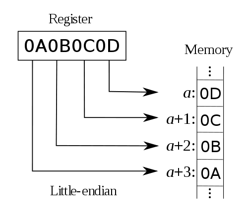

## 字节序（Byte Order）
> 我们一般把字节（byte）看作是数据的最小单位。当然，其实一个字节中还包含8个bit (bit = binary digit)

#### 大字节序（big endian, 又称：大端序）
是指其“最高有效位（most significant byte）”落在低地址上的存储方式。例如像地址a写入0x0A0B0C0D之后，在内存中的数据便是：

#### 小字节序（little endian, 又称：小端序）
是指其“最低有效位（least significant byte）”放在低地址上。

### Go 处理字节序
Go中处理大小端序的代码位于 encoding/binary ,包中的全局变量BigEndian用于操作大端序数据，LittleEndian用于操作小端序数据，这两个变量所对应的数据类型都实行了ByteOrder接口：

    type ByteOrder interface {
        Uint16([]byte) uint16
        Uint32([]byte) uint32
        Uint64([]byte) uint64
        PutUint16([]byte, uint16)
        PutUint32([]byte, uint32)
        PutUint64([]byte, uint64)
        String() string
    }
其中，前三个方法用于读取数据，后三个方法用于写入数据。

http://lihaoquan.me/2016/11/5/golang-byteorder.html