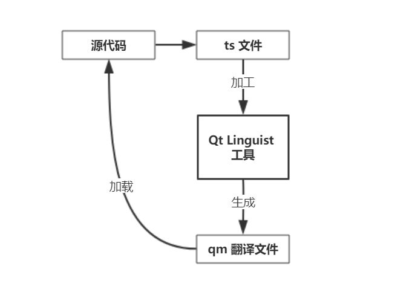

## Qt 的多语言支持的翻译机制
- 和翻译相关的 Qt 类
Qt 的翻译功能很简单，所用到的工具类就那么几个，最常用的就是 QTranslator、QTextCodec、QLocale 这三个类。所有关于翻译的类及其说明如下：
	- `QTranslator`：存储翻译文件，执行翻译操作。
	- `QLocale`：存储本机的区域设置，还可以不同区域格式的转换。
	- `QTextCodec`：一个编/解码的小工具。
    - `QTextDecoder`：可以根据字节流的状态正确拼接字节流，从而进行解码操作，常用于网络。
    - `QTextEncoder`：可以根据字节流的状态正确拼接字节流，从而进行编码操作，常用于网络。
    - `QCollator`：基于不同区域来对比字符串的类。
    - `QCollatorSortKey`：用于加速一个字符串的排序
