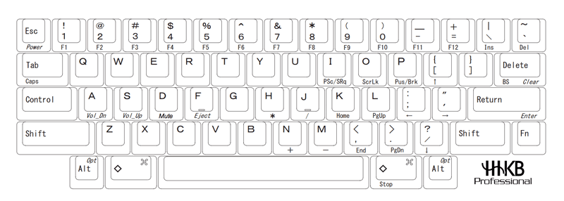

## HHKB
- 键盘布局

	- fn + tab : 切换大小写
	- cmd + 空格 ：切换输入法
	- fn + O : 光线变暗
	- fn + P :光线变亮
	- fn + [ : 上键
	- fn + " : 右键
	- fn + ? : 下键
	- fn + A : 声音降
	- fn + S : 声音升
	- HHKB键盘提供了三种模式，分别是HHK模式、Lite Ext.模式和Mac/iOS模式。通过调节“1”“2”号DIP开关，可以随时在三种模式中切换。
		- 默认状态下键盘为HHK模式，即“1”号开关OFF，“2”号开关OFF
		- “1”号开关ON，“2”号开关OFF，则为Lite Ext.模式。
		- “1”号开关OFF“2”号开关ON，则为Mac/iOS模式。
	- 3号DIP开关的主要功能是切换Delete键功能。
	- 3号DIP开关置于ON位置时，默认的Delete键就变成了Backspace键，则Fn + ~变成了Delete
	- 4号DIP开关用来控制左“◇”键是否切换为Fn。OFF状态下左“◇”键就是左“◇”键，ON状态下左“◇”键变身为Fn键
	- 5号DIP开关是用来控制ALT键和“◇”键互换功能的。OFF状态下按键均按默认状态功能。ON状态下ALT键和“◇”键功能互换。ALT键变成“◇”键， “◇”键则变成ALT键，以适应Windows用户使用习惯。
	- 6号DIP开关是用来控制是否节能省电的开关。OFF状态下，键盘30分钟无输入自动进入关闭状态，可通过按下任意按键或长按电源开关开关重新开启键盘。ON状态下，即便30分钟内没有输入键盘也不会进入关闭状态，这样的设置明显会更费电。另外，如果你使用USB连接线进行供电，无论6号DIP开关处于ON还是OFF状态，键盘都不会自动进入关闭状态。