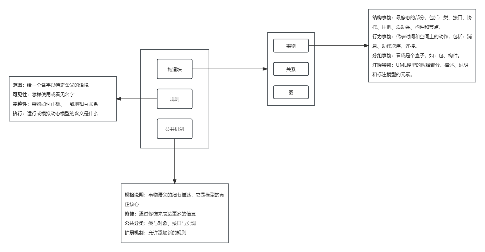

## 十五、需求工程
#### 需求工程--概述
- 需求工程：需求分析和需求管理。
- 系统分析：软件需求分析、硬件需求分析、网络需求分析
- 软件需求是指用户在功能、行为、性能、设计约束等方面对系统的期望，分为需求开发和需求管理两大过程：
	- 需求开发（技术维度）
		- 需求获取
		- 需求分析
		- 需求定义（需求规格说明书）
		- 需求验证-＞需求基线
	- 需求管理（管理维度）
		- 变更控制
		- 版本控制
		- 需求跟踪：客户提出的需求，记录需求被实现的过程，有自向跟踪，反向跟踪。
			- 用户原始需求-＞软件需求-＞下游工作产品。
		- 需求状态跟踪
			- 被建议
			- 被批准
			- 被实现
			- 被验证
			- 被交付
			- 被拒绝
			- 被抛弃
- 需求的获取
	- 收集资料
	- 联合讨论会
	- 用户访谈
	- 现场观摩
	- 参加业务实践
	- 阅读历史文档
	- 抽样调查（节省成本的一种方法，经常与其它方法相结合）
- 需求跟踪
	- 在CMMI中，需求管理是已管理级的一个关键过程域，其目标是**为产品需求建立一个基线，供软件开发及其管理使用，使计划、产品和活动与需求保持一致**。
	- 从需求工程的角度来看，**需求管理**包括在产品开发过程中维持需求一致性和精确性的所有活动，包括控制需求基线，保持项目计划与需求一致，控制单个需求和需求文档的版本情况，管理需求和联系链之间的联系，或管理单个需求和项目其他可交付物之间的依赖关系，跟踪基线中需求的状态。
	- 可跟踪性包含两个层面的含义：
		- （1）项目执行过程的两个或多个产品之间能够建立关系的程度，尤其是那些具有前后关系或主从关系的产品。例如，某个给定构件的需求和设计的匹配程度；
		- （2）项目产品中每个元素能够建立其存在理由的程度，例如，产品设计中的每个元素定位它所满足需求的程度。
	- **可跟踪性**是项目需求的一个重要特征，需求跟踪是将单个需求和其他元素之间的依赖关系和逻辑联系建立跟踪，这些元素包括各种类型的需求、业务规则、系统组件，以及帮助文件等。
- 在结构化分析方法中，用**数据流图（DFD）**表示功能模型，用**状态转换图**表示行为模型。
- UML

	- **类**是描述具有相同属性、方法、关系和语义的对象的集合，一个类实现一个或多个接口。
	- **接口**是指类或构件提供特定服务的一组操作的集合，接口描述了类或构件的对外的可见的动作。
	- **构件**是物理上或可替换的系统部分，它实现了一个接口集合。
	- **包**是一种将有组织的元素分组的机制。
	- **用例**是描述一系列的动作，产生有价值的结果。
	- **协作**定义了交互的操作，是一些角色和其他事物一起工作，提供一些合作的动作，这些动作比事物的综合要大。
	- **节点**是一个物理元素，它在运行时存在，代表一个可计算的资源，通常占用一些内存和具有处理能力。