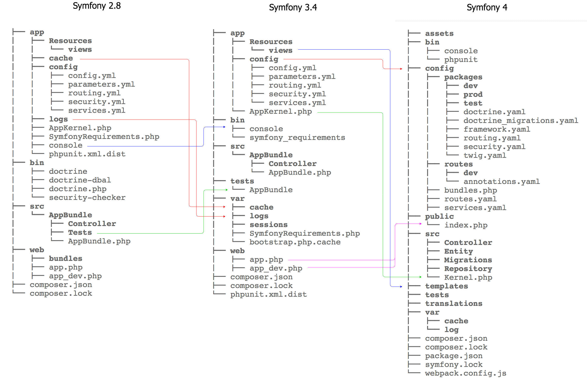

## Symfony 4 & 5 相关
- [flex:Composer plugin for Symfony](flex.md)
- [recipes symfony核心团队认证的“菜谱”](recipes.md)
- [recipes-contrib 非“官方”菜谱](recipes-contrib.md)
- [maker-bundle](maker-bundle.md)
- [flash-messages](flash-messagers.md)
- [frontend](frontend.md)
- [messenger](messenger.md)
- [passwords](passwords.md)
- [testing](testing.md)
- [translation](translation.md)
- [模板支持hinclude.js](hinclude.js.md)
- [Stimulus & Symfony UX](StimulusSymfonyUX.md)
- [Symfony UX Turbo](turbo.md)
- [ContainerBagInterface](ContainerBagInterface.md)
- [Rate Limiter](RateLimiter.md)
- [Security 安全部分](Security.md)
- 目录结构变化

